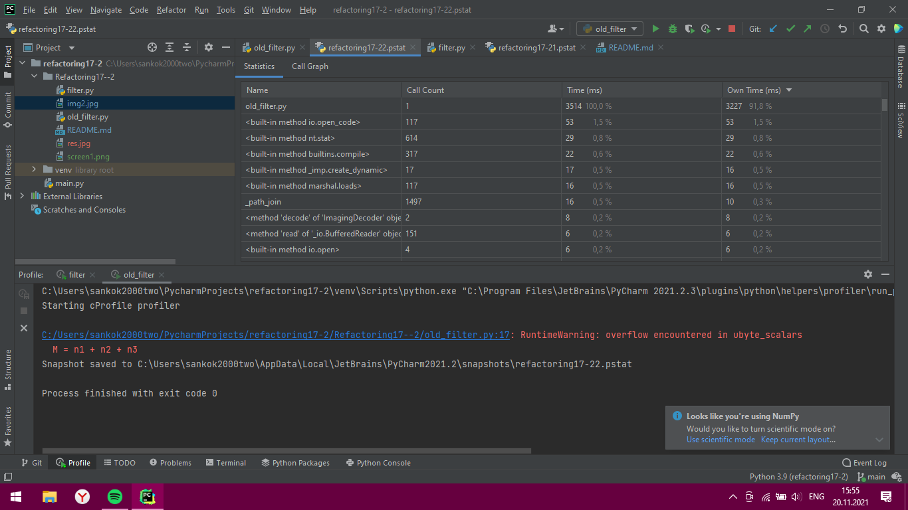

# Refactoring17--2
## Время выполнения файлов
1. Анализ ***filter.py*** с помощью встроенного профилизатора

2. Анализ ***old_filter.py*** с помощью встроенного профилизатора

Разница во времени вызвана тем, что в новом варианте фильтра большая часть времени выполнения затрачивается на ввод данных пользователем.

3. Анализ ***filter_with_filename.py*** с помощью встроенного профилизатора

Сильное уменьшение времени работы файла вызвано тем, что данные не вводятся пользователем.
##Исходное изображение и результаты
###Исходное изображение:

###Результирующее изображение ***filter_with_filename.py***:

###Результирующее изображение ***old_filter.py***:

